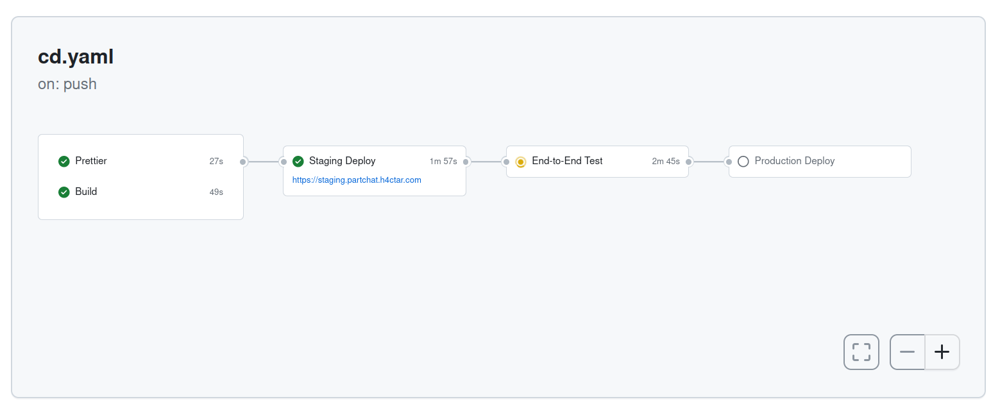

# Part Chat


## Pipelines

There is one continuous deployment GitHub workflow.
It runs on all pushes to the main branch, deploys to a preview environment where it runs the end-2-end tests and if they pass it deploys to prod.

The setup-node action is used to cache node dependencies.
A cache is also created for the playwright binaries; it uses the playwright version in the key to ensure it is updated when the playwright version changes.

The deployment URL is stored in the `url` output of the `preview-deploy` job and retrieved in the `end-2-end-test` job.



## End-2-End Tests

End-2-end tests use Playwright and should test all nominal flows.

## Database

The data is persisted in a PlanetScale SQL database using the Prisma ORM.


There are two branches of the database, one for production and one for preview.

## REST Resources

The REST API has these resources:

-   Motorcycle
-   Diagram
-   Diagram / PartReference
-   Part
-   Comment

## API Deployment

## API Cache Control

## Authentication/Authorisation

## Responsive Layouts

## Comment Editor

## Dev Environment

1. Install Vercel CLI globally

    ```
    yarn global add vercel@latest
    ```

2. Pull Vercel environment

    ```zsh
    vercel pull
    ```

3. Run Vercel dev

    ```zsh
    vercel dev
    ```
