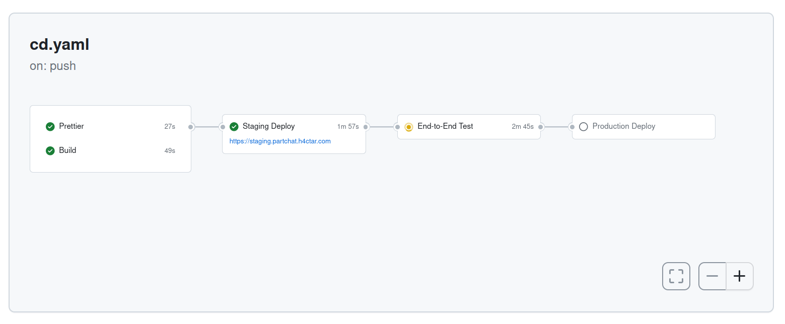
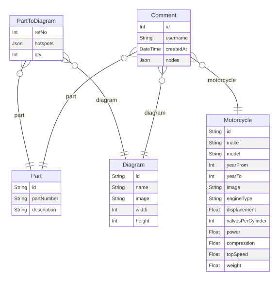

# Part Chat


## Pipelines

There is one continuous deployment GitHub workflow.
It runs on all pushes, deploys to a staging environment where it runs the end-2-end tests and if they pass it deploys to prod (only if main branch).

The setup-node action is used to cache node dependencies.
A cache is also created for the playwright binaries; it uses the playwright version in the key to ensure it is updated when the playwright version changes.



## End-2-End Tests

End-2-end tests use Playwright and should test all nominal flows.

## Database

The data is persisted in a SQLite database using the Prisma ORM.



## REST Resources

The REST API has these resources:

-   Motorcycle
-   Diagram
-   Diagram / PartReference
-   Part
-   Comment

## Authentication/Authorisation

## Responsive Layouts

## Comment Editor

## Dev Environment

1. Install dependencies:

    ```
    npm install
    ```

2. Build everything:

    ```
    npm run build --workspaces --if-present
    ```

3. Run the backend:

    ```
    cd backend
    npm run db:push
    npm run db:seed
    npm run dev
    ```

4. Run the frontend:

    ```zsh
    cd frontend
    npm run dev
    ```

## Deploy

```
[Unit]
Description=Partchat
Documentation=https://github.com/h4ctar/partchat
After=network.target

[Service]
Environment=JWKS_URL=<JWKS_URL>
Environment=ISSUER=<ISSUER>
Environment=PORT=<PORT>
Type=simple
User=<USER>
ExecStart=/usr/bin/node /opt/partchat/backend/dist/src/server.js
Restart=on-failure

[Install]
WantedBy=multi-user.target
```
